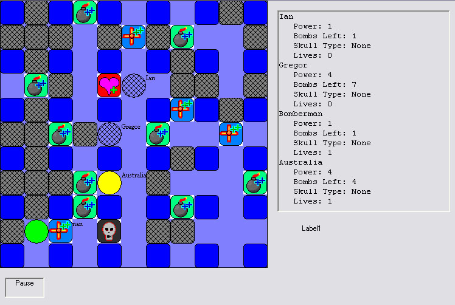



## Bomberman

### Description

This game was designed and coded for an assignment, and many of my friends have enjoyed playing it so i thought i would share it with more people.
 
### More Info
 
The aim of the game is to be the last standing person (... little cirlce to be precise). If this game is incompatible with your version of Visual Basic then the executable is at http://nkq0rs.spaces.live.com and so is some info about the updates (what isnt mentioned in the instructions).

             |
---                |---
**Submitted On**   |2006-10-07 18:04:12
**By**             |[Ian Gregor](https://github.com/Planet-Source-Code/PSCIndex/blob/master/ByAuthor/ian-gregor.md)
**Level**          |Intermediate
**User Rating**    |4.8 (19 globes from 4 users)
**Compatibility**  |VB 6\.0
**Category**       |[Games](https://github.com/Planet-Source-Code/PSCIndex/blob/master/ByCategory/games__1-38.md)
**World**          |[Visual Basic](https://github.com/Planet-Source-Code/PSCIndex/blob/master/ByWorld/visual-basic.md)
**Archive File**   |[Bomberman20246510132006\.zip](https://github.com/Planet-Source-Code/ian-gregor-bomberman__1-66724/archive/master.zip)

